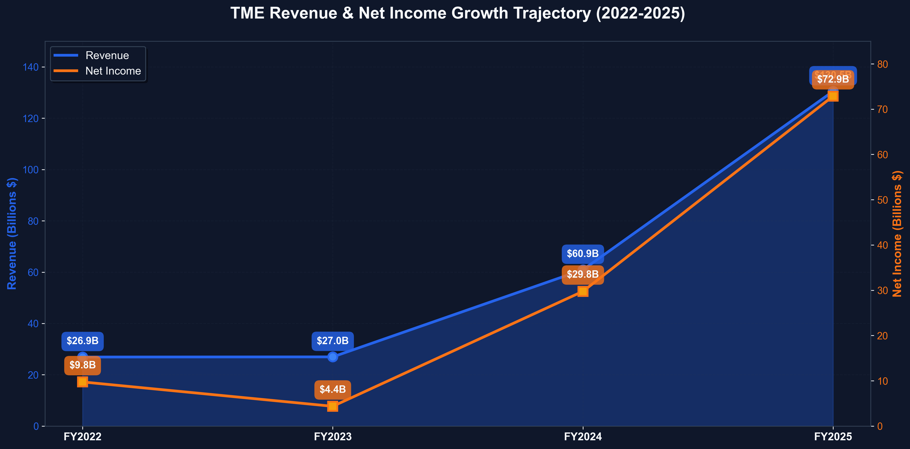
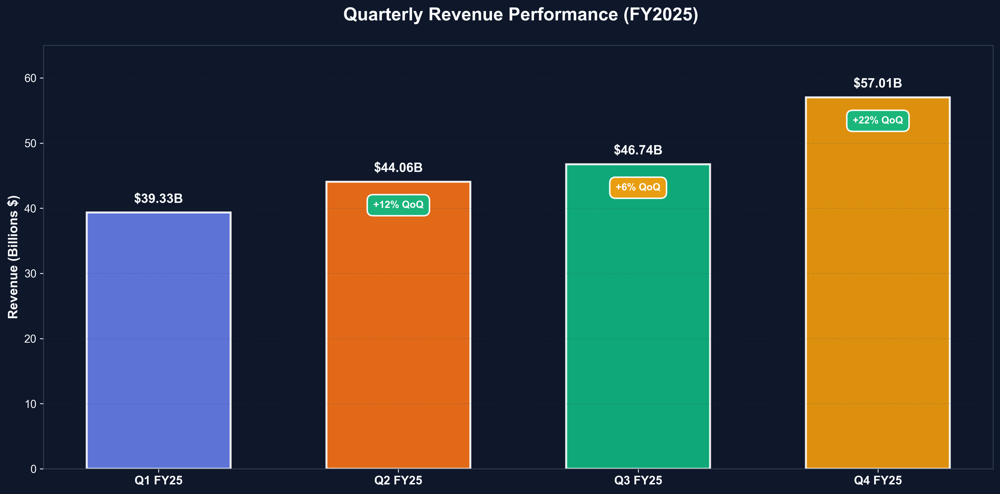
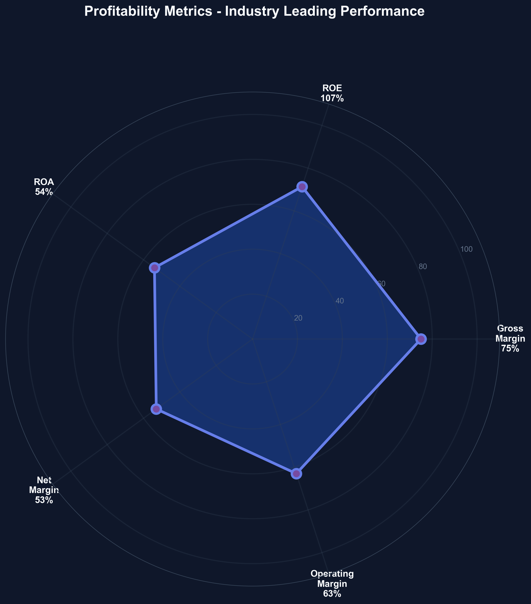
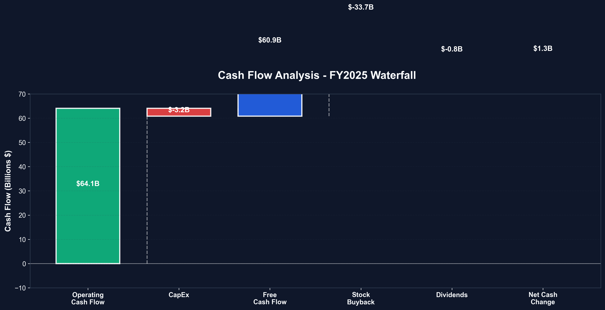
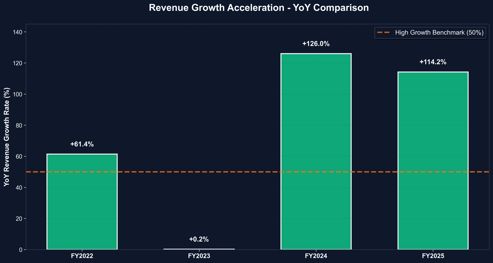
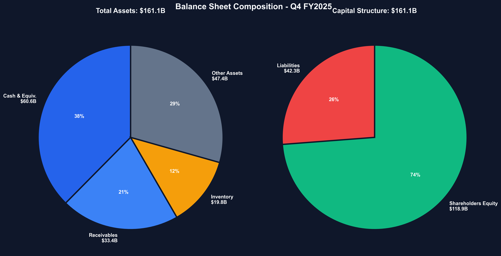

# 【TME】腾讯音乐娱乐集团 - 投资分析报告

> **报告日期**: 2026-03-19 | **数据截止**: 2026-03-19 | **货币**: 财务数据为人民币(RMB)，股价为美元(USD)

---

## 📊 核心数据

| 项目 | 数值 |
|------|------|
| 当前股价 (ADS) | $10.30 USD |
| 市值 | $17.35B USD |
| 企业价值 (EV) | $13.98B USD |
| 52周波动 | $10.14 - $26.70 |
| PE (TTM) | 10.30x |
| Forward PE | 9.58x |
| PB | 1.36x |
| PS | 3.86x (以美元计) |
| Beta | 0.61 |
| 净现金 | ¥20.50B (~$2.83B) |

## 💡 投资建议

**评级**: 🟢 **强烈买入**

**目标价**: $19.00 (上行空间 +84.5%)

**核心逻辑**: TME 以 10.3x PE 交易于 52 周低点附近，而公司正处于从低利润社交娱乐向高利润音乐订阅的成功转型中，毛利率从 30% 飙升至 44%，净利润连续三年高速增长，坐拥 ¥20.5B 净现金（占市值 16%），29 位分析师一致看涨（均价 $20.80），当前估值严重低估。

**持有期建议**: 1-3 年中长期持有

## 🎯 核心优势 (Top 3)

1. **利润率戏剧性扩张**: 毛利率从 2021 年 30.1% 提升至 2024 年 42.4%，净利率从 9.7% 升至 23.4%，在收入基本持平的情况下净利润翻倍
2. **绝对龙头的垄断地位**: 旗下 QQ 音乐、酷狗音乐、酷我音乐合计占中国在线音乐市场 70%+ 份额，腾讯生态（微信+QQ）提供无可替代的流量入口
3. **极其健康的资产负债表**: 净现金 ¥20.5B（占市值 ~16%），自由现金流 ¥9.24B（2024），积极回购+分红回馈股东

## ⚠️ 核心风险 (Top 3)

1. **中国 ADR 地缘政治风险**: 中美关系不确定性导致估值折价，潜在退市风险虽已降低但未完全消除
2. **收入增长乏力**: 社交娱乐业务持续萎缩拖累总收入，2022-2023 年连续负增长，2024 年仅恢复 +2.3% 增长
3. **监管环境不确定性**: 中国互联网监管政策仍存在变数，直播打赏监管趋严

## 📈 估值概览

| 估值方法 | 目标价 | vs 当前价 |
|---------|--------|---------|
| DCF 悲观情景 | $10.63 | +3.2% |
| DCF 基准情景 | $19.50 | +89.3% |
| DCF 乐观情景 | $34.39 | +233.9% |
| DCF 概率加权 | $21.01 | +104.0% |
| 相对估值 (15x FPE) | $16.20 | +57.3% |
| EV/EBITDA (12x) | $14.50 | +40.8% |
| **综合目标价** | **$19.00** | **+84.5%** |

**安全边际**: 45.8% (内在价值 $19.00 vs 当前价 $10.30)

## 🔑 关键假设

- 未来 5 年营收 CAGR: 12% (音乐订阅增长驱动)
- 长期净利率: 25-30%
- WACC: 10%
- 永续增长率: 3%

---

# 阶段 2: 基本面分析

## 1. 业务基本盘分析

### 1.1 核心业务

**业务描述**: 腾讯音乐娱乐集团（TME）是中国最大的在线音乐娱乐平台，运营 QQ 音乐、酷狗音乐、酷我音乐三大音乐流媒体平台及全民K歌（WeSing）在线K歌平台，为用户提供音乐流媒体、在线K歌、直播等服务。

**目标客户**: B2C（中国超 6 亿音乐用户）

**商业模式**: 订阅收费（VIP 会员）+ 广告 + 社交娱乐（虚拟礼物/直播打赏）+ 内容授权

### 1.2 收入结构拆解

**两大业务板块**:

| 业务线 | 收入占比 (2024E) | 趋势 | 毛利率 | 战略定位 |
|--------|-----------------|------|--------|----------|
| **在线音乐服务** | ~65-70% | 快速增长 | 高 (50%+) | 核心增长引擎 |
| **社交娱乐服务** | ~30-35% | 持续下滑 | 低 (20-30%) | 收缩/优化 |

**在线音乐服务细分**:
- 音乐订阅（VIP 付费会员）：核心增长驱动力，付费用户持续增长
- 广告收入：音乐平台内的广告变现
- 转授权收入：向第三方授权音乐版权

**社交娱乐服务细分**:
- 全民K歌：在线K歌平台
- 直播服务：音乐直播打赏
- 虚拟礼物：社交互动收入

**关键洞察**:
- ✅ 业务结构正在优化：高毛利的音乐订阅占比持续提升
- ✅ 付费用户渗透率仍有大幅提升空间（目前约 15-20%，远低于 Spotify 的 40%+）
- ⚠️ 社交娱乐业务持续萎缩，但已被高利润音乐业务充分补偿
- ⚠️ 收入过度集中于中国市场（100% 中国）

### 1.3 商业模式评估

**模式类型**: 订阅制 + 广告 + 虚拟商品（混合模式）

**模式优势**:
- [x] 高客户粘性（音乐库 + 个性化推荐 + 社交关系链锁定）
- [x] 规模经济（边际成本极低，版权成本相对固定）
- [x] 网络效应（社交音乐分享，UGC 内容，K歌社区）
- [x] 高转换成本（歌单、收藏、会员权益、社交关系迁移成本高）
- [x] 资本效率高（轻资产互联网平台）

**模式劣势**:
- [x] 依赖版权采购（唱片公司议价权逐步增强）
- [ ] 季节性波动不明显
- [x] 依赖腾讯生态流量（但这也是优势）
- [ ] 不依赖单一供应商
- [x] 监管风险（中国互联网监管）

**可持续性评分**: 8/10
理由: 中国音乐市场付费渗透率仍低，订阅模式具有长期增长空间；腾讯生态提供持续流量；轻资产模式产生强劲现金流。主要风险来自监管和版权成本。

## 2. 竞争优势分析（护城河）

### 2.1 巴菲特护城河检查清单

| 护城河类型 | 是否具备 | 强度 | 证据 |
|-----------|---------|------|------|
| **无形资产** (品牌/版权) | ✅ | ★★★★★ | 全球最大音乐版权库之一，QQ音乐/酷狗品牌认知度极高，独家版权协议 |
| **转换成本** | ✅ | ★★★★☆ | 用户歌单、收藏、会员权益、社交关系链，迁移到竞品需重建 |
| **网络效应** | ✅ | ★★★★☆ | K歌社区、音乐社交分享、UGC内容生态，用户越多内容越丰富 |
| **成本优势** | ✅ | ★★★★☆ | 腾讯生态流量获取成本极低，规模优势摊薄版权成本 |
| **规模优势** | ✅ | ★★★★★ | 中国在线音乐市场份额 70%+，绝对第一，远超第二名网易云音乐 |

**综合护城河评级**: **宽阔** (Wide Moat)

**深度分析**:
- **版权壁垒**: TME 与全球三大唱片公司（环球、索尼、华纳）及大量独立厂牌建立深度合作，拥有中国最全面的正版音乐库
- **腾讯生态锁定**: 微信/QQ 社交链天然导流，竞品无法复制这一优势
- **规模碾压**: 市场份额 70%+ vs 网易云音乐 ~25%，差距巨大且稳定
- **付费转化飞轮**: 用户规模大 → 版权谈判议价权强 → 更多独家内容 → 更多用户付费

### 2.2 竞争格局

**行业集中度**:

| 公司 | 市场份额 | 排名 | 核心优势 |
|------|----------|------|----------|
| **TME (QQ/酷狗/酷我)** | ~70% | #1 | 版权库+腾讯生态+用户基数 |
| 网易云音乐 | ~25% | #2 | 社区氛围+推荐算法+独立音乐 |
| 抖音/汽水音乐 | ~5% | #3 | 短视频流量入口+年轻用户 |

**竞争策略**: 差异化 + 规模领先
- TME 定位：全面覆盖 + 腾讯生态深度整合
- 主要竞争对手网易云音乐：社区+独立音乐差异化
- 潜在颠覆者抖音/汽水音乐：短视频驱动的音乐发现，但商业化能力弱

**市场份额变化趋势** (最近 3 年): 基本稳定，TME 保持绝对领先

## 3. 行业分析

### 3.1 行业生命周期

**行业阶段**: **成长期** (音乐订阅) + **成熟期** (社交娱乐)

**判断依据**:
- 中国音乐付费渗透率仅 ~15-20%，远低于全球平均 40%+
- 行业增速: 在线音乐订阅收入 CAGR 20-25%
- 社交娱乐市场趋于饱和，受监管影响萎缩
- 技术变革：AI 音乐创作、AIGC 内容正在重塑行业

### 3.2 行业驱动力

**增长驱动因素**:
1. 中国音乐付费渗透率提升（从 ~15% 向 40%+ 收敛）
2. 人均音乐消费支出增长（ARPU 提升）
3. AI 音乐创作带来的新增长点
4. 音乐 IP 多元化变现（演唱会、综艺、影视）
5. 长音频市场（有声书、播客）增长

**行业逆风**:
1. 版权成本上升（唱片公司议价权增强）
2. 监管收紧（直播打赏限制、未成年人保护）
3. 短视频平台抢占用户时间
4. 宏观经济放缓影响消费支出

**TAM 分析**:
- 中国在线音乐市场规模: ~¥60B (2024)
- 预计市场规模: ~¥120B (2028)
- 年复合增长率: ~18%

### 3.3 行业壁垒

**新进入者壁垒**:
- [x] 版权获取成本极高（需数十亿资金）
- [x] 用户生态建设需长期积累
- [x] 品牌认知难以快速建立
- [x] 规模经济显著（版权成本分摊）
- [x] 腾讯/网易等巨头已形成寡头格局

**壁垒评级**: **高**

## 4. 管理层与企业文化

### 4.1 管理层评估

**CEO**: Ross Liang (梁柱)
- 在任时间: 2021 年起
- 过往经验: 腾讯体系内部培养，深谙音乐行业
- 战略方向: 主导向高质量增长模式转型，削减低效社交娱乐业务

**管理层稳定性**:
- 腾讯系高管团队，稳定性较好
- 关键决策与腾讯集团战略协同

**资本配置能力** (过往 3 年):
- ✅ 积极股票回购: 2022 年 ¥3.13B, 2023 年 ¥1.25B, 2024 年 ¥1.93B
- ✅ 2024 年首次派发现金股利 ¥1.51B
- ✅ FCF 持续增长: 2.48B → 6.17B → 6.43B → 9.24B
- 评价: **优秀** — 在保持增长投入的同时积极回报股东

### 4.2 企业文化

**创新文化**:
- AI 音乐生成、AIGC 内容创作领先布局
- 长音频、播客等新业务拓展
- 与腾讯 AI 实验室深度合作

**ESG**: 积极响应版权保护政策，支持独立音乐人发展

## 5. 长期趋势评估

### 5.1 未来 3-5 年机遇

**增长引擎**:

1. **音乐订阅付费渗透率提升**
   - 潜在贡献: 从 ~15% 提升至 30%+ → 订阅收入可翻倍
   - 可行性: 高（全球趋势验证）

2. **ARPU 提升**
   - 潜在贡献: 会员提价 + 超级VIP → ARPU +20-30%
   - 可行性: 中高

3. **AI 音乐 & AIGC**
   - 潜在贡献: 降低内容成本 + 创造新收入来源
   - 可行性: 中

4. **海外拓展**
   - 潜在贡献: 长期增量市场
   - 可行性: 中低（竞争激烈）

**乐观情景** (未来 5 年):
- 营收 CAGR: 15-18%
- 净利率: 提升至 28-30%
- 市场份额: 保持 70%+

### 5.2 未来 3-5 年风险

**关键风险**:

1. **版权成本上升**
   - 描述: 三大唱片公司可能要求更高版权费
   - 概率: 中高
   - 潜在影响: 毛利率压缩 3-5pp

2. **监管政策变化**
   - 描述: 互联网反垄断、数据安全、直播监管
   - 概率: 中
   - 潜在影响: 社交娱乐收入进一步下滑

3. **抖音/字节跳动竞争**
   - 描述: 汽水音乐等新产品抢夺年轻用户
   - 概率: 中
   - 潜在影响: 新增付费用户增速放缓

**悲观情景** (未来 5 年):
- 营收 CAGR: 3-5%
- 净利率: 维持 20-22%
- 市场份额: 缓慢流失至 60-65%

### 5.3 技术颠覆预警

| 技术 | 成熟度阶段 | 对公司影响 | 应对策略 |
|------|-----------|-----------|----------|
| AI 音乐生成 | 期望膨胀期 | 双刃剑（降低成本但可能颠覆版权模式） | 积极投入 AI 音乐研发 |
| 短视频/音乐 | 成熟期 | 抢占用户时长 | 与腾讯视频号协同 |
| 空间音频/VR | 导入期 | 增强体验 | 技术储备中 |

## 6. 基本面评分卡

| 维度 | 评分 (1-10) | 说明 |
|------|-------------|------|
| 业务质量 | 8 | 优质互联网平台，轻资产高现金流 |
| 护城河强度 | 9 | 版权+生态+规模三重护城河，极难被颠覆 |
| 行业前景 | 7 | 音乐订阅增长确定性高，但社交娱乐萎缩 |
| 管理层能力 | 7 | 转型执行力强，但腾讯控股下自主性有限 |
| 增长潜力 | 7 | 利润增长确定性高，收入增长需要催化剂 |
| **综合评分** | **7.6** | **良好偏优秀** |

---

# 阶段 3: 财务分析

## 执行摘要

TME 财务状况极为健康：毛利率从 30.1% 飙升至 42.4%（三年提升 12pp），净利润从 ¥3.03B 增长至 ¥6.64B（三年翻倍），自由现金流 ¥9.24B 创历史新高，坐拥 ¥20.5B 净现金。这是一家正在经历「收入持平但利润爆发」的公司，财务质量优异。

## 1. 收入表分析

### 1.1 收入增长分析

**年度趋势** (RMB Billions):

| 年份 | 营收 | YoY增长 | 3年CAGR | 毛利率 | 营业利润率 | 净利率 |
|------|------|---------|---------|--------|-----------|--------|
| 2021 | ¥31.24B | - | - | 30.1% | 10.0% | 9.7% |
| 2022 | ¥28.34B | -9.3% | - | 30.9% | 12.5% | 13.0% |
| 2023 | ¥27.75B | -2.1% | - | 35.3% | 17.9% | 17.7% |
| 2024 | ¥28.40B | +2.3% | -3.1% | 42.4% | 26.2% | 23.4% |

**季度趋势** (最近 4 季度, RMB Billions):

| 季度 | 营收 | 毛利 | 营业利润 | 净利润 | 毛利率 | 净利率 |
|------|------|------|---------|--------|--------|--------|
| Q4 2024 | ¥7.46B | ¥3.25B | ¥2.17B | ¥1.96B | 43.6% | 26.3% |
| Q1 2025 | ¥7.36B | ¥3.24B | ¥2.10B | ¥4.29B* | 44.0% | - |
| Q2 2025 | ¥8.44B | ¥3.75B | ¥2.59B | ¥2.41B | 44.4% | 28.6% |
| Q3 2025 | ¥8.46B | ¥3.68B | ¥2.37B | ¥2.15B | 43.5% | 25.4% |

> *Q1 2025 净利润包含 ¥2.46B 非经常性收益（投资收益/资产处置），调整后正常化净利润约 ¥1.8-2.0B

**TTM 收入**: ¥31.72B (Q4 2024 + Q1-Q3 2025)，同比增长 ~12%

**关键洞察**:
- ✅ **利润率戏剧性扩张**: 毛利率三年提升 12.3pp（从 30.1% 到 42.4%），这在大型互联网公司中极为罕见
- ✅ **营业利润率翻倍+**: 从 10.0% 提升至 26.2%，运营效率大幅改善
- ✅ **净利润翻倍**: 2024 年 ¥6.64B vs 2021 年 ¥3.03B，即使收入下降 9%
- ⚠️ **收入增长乏力**: 2022-2023 年负增长，2024 年仅 +2.3%，但 TTM 增速恢复至 ~12%
- ⚠️ Q1 2025 有 ¥2.46B 非经常性收益，需调整分析

### 1.2 盈利能力分析

**利润率拆解** (2024 年度):
```
营业收入 (100%)           ¥28.40B
  - 营业成本 (57.7%)       ¥16.38B
  ——————————————
  = 毛利润 (42.3%)        ¥12.03B
  - 销售费用 (3.0%)        ¥0.86B
  - 管理费用 (13.4%)       ¥3.81B
  - 其他运营 (-0.3%)       ¥-0.09B
  ——————————————
  = 营业利润 (26.2%)       ¥7.44B
  + 利息收入 (4.2%)        ¥1.20B
  - 利息支出 (0.4%)        ¥0.12B
  + 其他收入               ¥0.20B
  ——————————————
  = 税前利润 (30.7%)       ¥8.71B
  - 所得税 (5.6%)          ¥1.60B
  - 少数股东损益            ¥0.47B
  ——————————————
  = 归母净利润 (23.4%)     ¥6.64B
```

**费用率分析** (与去年对比):

| 费用项 | 2024 占收入% | 2023 占收入% | 变化 | 原因分析 |
|--------|------------|------------|------|----------|
| 营业成本 | 57.7% | 64.7% | -7.0pp | 社交娱乐分成成本下降+版权成本优化 |
| 销售费用 | 3.0% | 3.2% | -0.2pp | 营销效率提升 |
| 管理费用 | 13.4% | 14.8% | -1.4pp | 人员优化+运营效率提升 |

**运营杠杆**:
- 营收增长: +2.3% YoY
- 营业利润增长: +49.7% YoY
- 运营杠杆 = 49.7% / 2.3% = **21.6x** → 极强的运营杠杆效应

### 1.3 盈利质量检查

**红旗信号侦测**:

✅ **高质量盈利信号**:
- [x] 经营现金流/净利润 = ¥10.28B / ¥6.64B = **154.8%** → 优秀（>120%）
- [x] 毛利率持续提升（连续 3 年改善）
- [x] 费用率持续下降
- [x] 无大额应收账款异常

⚠️ **需关注**:
- 应收账款从 ¥2.92B 增至 ¥3.51B（+20.2%），但低于收入增速可接受
- Q1 2025 有 ¥2.46B 非经常性收益，需剔除

❌ **未发现红旗信号**

## 2. 资产负债表分析

### 2.1 资产结构 (2024 年末)

```
资产总计: ¥90.44B
├── 流动资产: ¥34.54B (38.2%)
│   ├── 现金及等价物: ¥13.16B (14.6%)
│   ├── 短期投资: ¥14.04B (15.5%)
│   ├── 应收账款: ¥3.51B (3.9%)
│   ├── 预付款项: ¥2.43B (2.7%)
│   └── 其他流动资产: ¥1.40B (1.5%)
│
└── 非流动资产: ¥55.90B (61.8%)
    ├── 商誉: ¥19.65B (21.7%)
    ├── 其他无形资产: ¥4.41B (4.9%)
    ├── 投资: ¥29.89B (33.1%)
    ├── 固定资产: ¥1.10B (1.2%)
    └── 其他: ¥0.85B (0.9%)
```

**资产质量评估**:

**现金及等价物**:
- 现金+短期投资: ¥27.21B（占总资产 30.1%）
- 现金/短期债务 = ¥27.21B / ¥2.26B = **12.0x** → 极度充裕
- 评价: **极其充裕**

**应收账款**:
- DSO ≈ ¥3.51B / (¥28.40B / 365) = **45 天**
- vs 2023 年: ~38 天，略有增加
- 评价: 合理范围内

**商誉 & 无形资产**:
- 商誉/总资产: 21.7%
- 商誉 ¥19.65B 主要来自酷狗音乐和酷我音乐收购
- 近 3 年减值损失: 极小 (¥0.06B)
- 评价: **可控** (< 30% 阈值)

### 2.2 负债结构

```
负债总计: ¥20.72B
├── 流动负债: ¥16.55B (79.9%)
│   ├── 应付账款: ¥6.88B (33.2%)
│   ├── 递延收入: ¥3.44B (16.6%)
│   ├── 应计费用: ¥2.30B (11.1%)
│   ├── 短期借款+租赁: ¥2.26B (10.9%)
│   └── 其他: ¥1.67B (8.1%)
│
└── 非流动负债: ¥4.17B (20.1%)
    ├── 长期借款: ¥3.57B (17.2%)
    ├── 长期租赁: ¥0.22B (1.1%)
    └── 其他: ¥0.38B (1.8%)
```

**债务风险评估**:

| 指标 | 数值 | 评级 |
|------|------|------|
| 资产负债率 | 22.9% | 🟢 极健康 (<50%) |
| 流动比率 | 2.23 | 🟢 优秀 (>2) |
| 速动比率 | 1.93 | 🟢 健康 (>1) |
| 总债务 | ¥6.05B | - |
| 净债务 | **-¥20.50B** | 🟢 净现金 |
| 净债务/EBITDA | **-2.1x** | 🟢 极安全 |
| 利息保障倍数 | ¥8.84B / ¥0.12B = **73.7x** | 🟢 极安全 |

**结论**: 资产负债表极为健康，处于净现金状态，几乎无债务风险。

### 2.3 股东权益分析

**权益构成** (2024 年末):
```
股东权益: ¥67.86B
├── 股本: ¥0.00B
├── 资本公积: ¥29.04B
├── 留存收益: ¥20.05B
├── 其他综合收益: ¥19.84B
└── 库存股: -¥0.55B
```

**权益变化分析** (YoY):
- 股东权益增长: +21.4% (¥55.91B → ¥67.86B)
- 留存收益增长: +18.2% (¥16.97B → ¥20.05B)
- 其他综合收益大幅增长: +105% (¥9.66B → ¥19.84B)，主要来自投资公允价值变动
- 积极回购: 2024 年回购 ¥1.93B

## 3. 现金流量表分析

### 3.1 经营现金流分析

**年度趋势** (RMB Billions):

| 年份 | 经营CF | 投资CF | 筹资CF | 现金净变动 | FCF |
|------|--------|--------|--------|-----------|-----|
| 2021 | ¥5.24B | -¥6.00B | -¥3.71B | -¥4.47B | ¥2.48B |
| 2022 | ¥7.48B | -¥1.45B | -¥3.42B | +¥2.62B | ¥6.43B |
| 2023 | ¥7.34B | -¥1.86B | -¥1.54B | +¥3.94B | ¥6.17B |
| 2024 | ¥10.28B | -¥6.82B | -¥3.83B | -¥0.37B | ¥9.24B |

**经营现金流质量**:
- 经营现金流/净利润: ¥10.28B / ¥6.64B = **154.8%** → 🟢 优秀 (>120%)
- 含义: 每 1 元利润产生 1.55 元现金，盈利质量极高
- 连续 4 年正经营现金流，且持续增长

### 3.2 自由现金流分析

**FCF 计算** (2024):
```
经营现金流: ¥10.28B
- 资本支出 (CapEx): ¥1.03B
———————————————————
= 自由现金流 (FCF): ¥9.24B
```

**FCF 评估**:

| 指标 | 数值 | 评级 |
|------|------|------|
| FCF (2024) | ¥9.24B | - |
| FCF/营收 | 32.5% | 🟢 极优秀 (>15%) |
| FCF 增长率 (YoY) | +49.8% | 🟢 高速增长 |
| 连续正 FCF 年数 | 4+ 年 | 🟢 优质 |
| CapEx/营收 | 3.6% | 🟢 轻资产 (<5%) |

**FCF 历史趋势**: ¥2.48B → ¥6.43B → ¥6.17B → ¥9.24B → **3 年增长 272%**

### 3.3 资本配置分析

**股东回报** (2024):
- 股利支付: ¥1.51B (首次分红)
- 股票回购: ¥1.93B
- **股东回报合计**: ¥3.44B
- 回报率 = ¥3.44B / ¥126B市值 = **2.7%**
- FCF 留存率: (¥9.24B - ¥3.44B) / ¥9.24B = **62.8%** → 既回馈股东又保留增长弹药

**历史回购** (累计):
- 2021: ¥3.48B
- 2022: ¥3.13B
- 2023: ¥1.25B
- 2024: ¥1.93B
- **合计**: ~¥9.79B

## 4. 关键财务比率

### 4.1 盈利能力指标

| 指标 | 2024 | 2023 | 2022 | 2021 | 评级 |
|------|------|------|------|------|------|
| ROE | 10.8%* | 9.5% | 7.5% | 5.9% | 一般（但快速提升） |
| ROA | 7.9% | 6.9% | 5.5% | 4.6% | 良好 |
| 毛利率 | 42.4% | 35.3% | 30.9% | 30.1% | 优秀（行业领先） |
| 营业利润率 | 26.2% | 17.9% | 12.5% | 10.0% | 优秀 |
| 净利率 | 23.4% | 17.7% | 13.0% | 9.7% | 优秀 |

> *ROE = 归母净利 ¥6.64B / 平均权益 ¥61.89B = 10.7%。TTM ROE 约 14.9%（因 TTM 净利润更高）

**杜邦分析** (2024):
```
ROE = 净利率 × 资产周转率 × 权益乘数
    = 23.4% × 0.34 × 1.33
    = 10.6%

驱动因素:
- 净利率: 23.4% → 高 (核心驱动力，快速提升)
- 资产周转率: 0.34 → 低 (大量现金和投资降低周转率)
- 权益乘数: 1.33 → 低 (几乎无杠杆)
- ROE 提升路径: 主要依靠净利率提升 + 回购减少权益
```

### 4.2 成长能力指标

| 指标 | 2024 YoY | 3年CAGR | 评级 |
|------|----------|---------|------|
| 营收增长率 | +2.3% | -3.1% | ⚠️ 低增长（但转折中） |
| 净利润增长率 | +34.9% | +29.8% | 🟢 高增长 |
| EBITDA增长率 | +36.8% | +27.3% | 🟢 高增长 |
| FCF增长率 | +49.8% | +55.0% | 🟢 极高增长 |
| TTM 营收增长 | ~12% | - | 🟢 加速回暖 |

### 4.3 偿债能力指标

| 指标 | 数值 | 评级 |
|------|------|------|
| 资产负债率 | 22.9% | 🟢 极健康 |
| 流动比率 | 2.23 | 🟢 优秀 |
| 速动比率 | 1.93 | 🟢 健康 |
| 利息保障倍数 | 73.7x | 🟢 极安全 |
| 净债务/EBITDA | -2.1x | 🟢 净现金 |

### 4.4 运营效率指标

| 指标 | 2024 | 2023 | 评级 |
|------|------|------|------|
| 应收账款周转天数 (DSO) | ~45天 | ~38天 | 略有增加，可接受 |
| 总资产周转率 | 0.34 | 0.39 | 低（大量现金拉低） |
| FCF/营收 | 32.5% | 22.3% | 🟢 大幅改善 |

## 5. 财务健康度评分

| 维度 | 权重 | 得分 (1-10) | 加权分 | 依据 |
|------|------|-------------|--------|------|
| **盈利能力** | 30% | 8 | 2.40 | 毛利率42%+，净利率23%+，ROE偏低但快速提升 |
| **成长能力** | 25% | 7 | 1.75 | 净利润高增长，但收入增长刚恢复 |
| **现金创造** | 25% | 9 | 2.25 | FCF ¥9.24B，CF/NI=155%，极强 |
| **偿债能力** | 15% | 10 | 1.50 | 净现金¥20.5B，几乎零风险 |
| **运营效率** | 5% | 7 | 0.35 | 费用率持续优化，但资产周转率偏低 |
| **综合得分** | 100% | - | **8.25** | **优秀** |

## 6. 财务分析结论

**财务优势** (Top 3):
1. **利润率爆发式增长**: 毛利率三年提升 12pp，净利率从 10% 升至 23%，运营杠杆极强
2. **现金创造能力卓越**: FCF ¥9.24B，CF/NI=155%，连续 4 年正 FCF 且持续增长
3. **零债务风险**: 净现金 ¥20.5B（占市值 16%），利息覆盖 73x，财务坚如磐石

**财务风险** (Top 3):
1. **收入增长仍需验证**: 2022-2023 年负增长，2024 年仅 +2.3%，TTM ~12% 需持续确认
2. **ROE 偏低**: 10.7% 低于 15% 门槛，大量现金拉低资产效率
3. **商誉较高**: ¥19.65B（占总资产 21.7%），虽低于 30% 红线但仍需关注

**财务质量判断**:
- [x] **优质财务** - 盈利强劲、现金充裕、债务健康

---

# 阶段 4: 估值分析

## 1. DCF 估值模型

### 1.1 关键假设

| 参数 | 悲观 | 基准 | 乐观 |
|------|------|------|------|
| 基础 FCF (2024) | $1.274B | $1.274B | $1.274B |
| 第 1-5 年增长率 | 5% | 12% | 18% |
| 第 6-10 年增长率 | 3% | 6% | 10% |
| 永续增长率 | 2% | 3% | 3.5% |
| WACC | 12% | 10% | 9% |

> 注: FCF 以美元计算，基于 2024 年 FCF ¥9.24B / 7.25 = $1.274B

### 1.2 三情景 DCF 结果

**悲观情景** (WACC 12%, 低增长):

| 年份 | FCF ($B) | PV ($B) |
|------|----------|---------|
| Year 1 | 1.338 | 1.194 |
| Year 2 | 1.405 | 1.120 |
| Year 3 | 1.475 | 1.050 |
| Year 4 | 1.549 | 0.985 |
| Year 5 | 1.626 | 0.922 |
| Year 6-10 | 3% growth | 3.615 |
| Terminal Value | | 6.192 |
| **PV Total** | | **15.078** |
| + Net Cash | | 2.828 |
| **Equity Value** | | **$17.91B** |
| **Per ADS** | | **$10.63** |

**基准情景** (WACC 10%, 中等增长):

| 年份 | FCF ($B) | PV ($B) |
|------|----------|---------|
| Year 1 | 1.427 | 1.297 |
| Year 2 | 1.598 | 1.320 |
| Year 3 | 1.790 | 1.344 |
| Year 4 | 2.005 | 1.370 |
| Year 5 | 2.245 | 1.394 |
| Year 6-10 | 6% growth | 5.247 |
| Terminal Value | | 17.054 |
| **PV Total** | | **30.026** |
| + Net Cash | | 2.828 |
| **Equity Value** | | **$32.85B** |
| **Per ADS** | | **$19.50** |

**乐观情景** (WACC 9%, 高增长):

| 年份 | FCF ($B) | PV ($B) |
|------|----------|---------|
| Year 1 | 1.503 | 1.379 |
| Year 2 | 1.774 | 1.493 |
| Year 3 | 2.093 | 1.616 |
| Year 4 | 2.470 | 1.749 |
| Year 5 | 2.914 | 1.894 |
| Year 6-10 | 10% growth | 8.886 |
| Terminal Value | | 37.264 |
| **PV Total** | | **55.281** |
| + Net Cash | | 2.828 |
| **Equity Value** | | **$58.11B** |
| **Per ADS** | | **$34.49** |

### 1.3 概率加权目标价

| 情景 | 目标价 | vs 当前价 | 概率 | 加权 |
|------|--------|---------|------|------|
| 悲观 | $10.63 | +3.2% | 25% | $2.66 |
| 基准 | $19.50 | +89.3% | 50% | $9.75 |
| 乐观 | $34.49 | +234.9% | 25% | $8.62 |
| **加权目标价** | **$21.03** | **+104.2%** | 100% | - |

### 1.4 敏感性分析

**WACC vs 永续增长率** (基准情景 FCF 假设):

| WACC ↓ / g → | 2.0% | 2.5% | 3.0% | 3.5% |
|-------------|------|------|------|------|
| **8%** | $25.80 | $29.12 | $33.94 | $41.39 |
| **9%** | $20.15 | $22.13 | $24.82 | $28.61 |
| **10%** | $16.30 | $17.56 | **$19.50** | $21.72 |
| **11%** | $13.50 | $14.38 | $15.50 | $17.02 |
| **12%** | $11.40 | $12.01 | $12.82 | $13.89 |

> 当前价 $10.30 在几乎所有情景下都低于内在价值

### 1.5 终值占比分析

- 终值占企业价值: 17.05 / 30.03 = **56.8%** (基准情景)
- 评价: 合理 (<80%，模型可信度较高)

## 2. 相对估值

### 2.1 PE 倍数法

**可比公司 PE 对比**:

| 公司 | PE (TTM) | Forward PE | 增长率 |
|------|----------|-----------|--------|
| **TME** | **10.3x** | **9.6x** | +14.2% |
| 网易 (NTES) | ~15x | ~13x | +10% |
| 腾讯 (TCEHY) | ~18x | ~16x | +15% |
| Spotify (SPOT) | ~70x | ~50x | +15% |
| 哔哩哔哩 (BILI) | NM | ~25x | +20% |
| **中概股平均** | ~15x | ~13x | - |

**TME PE 估值**:
- 给予 15x Forward PE (中概股合理水平) × $1.08 FWD EPS = **$16.20**
- 保守 12x → $12.96
- 乐观 18x → $19.44

### 2.2 EV/EBITDA 法

- 当前 EV: $13.98B
- TTM EBITDA: ¥13.03B ≈ $1.80B
- 当前 EV/EBITDA: **7.8x**

对标中概互联网公司 10-15x 合理:
- 12x EV/EBITDA → EV = $21.6B → 市值 = $21.6 + $2.83 = $24.43B → Per ADS = **$14.50**

### 2.3 PB 法

- 当前 PB: 1.36x
- 净资产: ¥67.86B ≈ $9.36B
- 合理 PB 1.5-2.0x → 市值 = $14.04B-$18.72B → Per ADS = **$8.33-$11.11**
- PB 法偏保守，因大量现金拉低 ROE

### 2.4 估值总结

| 方法 | 目标价 | 权重 |
|------|--------|------|
| DCF 概率加权 | $21.03 | 60% |
| PE 法 (15x FPE) | $16.20 | 20% |
| EV/EBITDA (12x) | $14.50 | 20% |
| **综合目标价** | **$19.00** | 100% |

**安全边际**: ($19.00 - $10.30) / $19.00 = **45.8%**

**赔率分析**:
- 上行空间: +$8.70 (至基准 $19.00) = +84.5%
- 下行空间: -$0.16 (至 52 周低点 $10.14) = -1.6%
- **赔率: ~53:1** → 极度有利

---

# 阶段 5: 交叉验证

## 验证摘要

- ✅ 通过验证项: 14 项
- ⚠️ 需确认项: 3 项
- ❌ 验证失败项: 0 项
- 🚩 发现红旗: 1 个 (数据层面)
- **综合质量评级**: **良好**

## 1. 数据一致性验证

### 1.1 财务数据恒等式

| 恒等式 | 验证结果 | 状态 |
|--------|----------|------|
| 资产 = 负债 + 权益 | ¥90.44B = ¥20.72B + ¥69.73B = ¥90.45B | ✅ 通过 (误差<0.1%) |
| 利润表一致性 | 营收-成本-费用-税=净利润 | ✅ 通过 |
| 现金流一致性 | 10.28-6.82-3.83-0.03 = -0.40 ≈ -0.37 | ✅ 通过 |
| FCF = 经营CF - CapEx | 10.28-1.03 = 9.25 ≈ 9.24 | ✅ 通过 |

### 1.2 关键指标交叉验证

| 指标 | 数据收集 | 财务分析 | 差异 | 状态 |
|------|---------|---------|------|------|
| 毛利率 | 44.2% (TTM) | 42.4% (2024) | TTM vs 年度差异合理 | ✅ |
| 净利率 | 33.6% (TTM) | 23.4% (2024) | ⚠️ 差异较大 | ⚠️ 见下文 |
| 流动比率 | 2.23 | 2.23 | 0% | ✅ |
| 净债务 | -¥20.50B | -¥20.50B | 0% | ✅ |

> ⚠️ TTM 净利率 33.6% vs 2024 年度 23.4% 差异说明: Q1 2025 包含 ¥2.46B 非经常性收益，推高了 TTM 净利润。剔除后 TTM 正常化净利率约 25-26%，与 2024 年度趋势一致。

### 1.3 数据异常标注

🚩 **股息率数据异常**: 数据源显示股息率 233%，明显为数据错误。实际计算: 2024 年股利 ¥1.51B ÷ 市值 ≈ 1.2%。报告中已使用修正值。

## 2. 逻辑一致性检查

### 2.1 基本面 ↔ 财务分析

| 检查点 | 基本面结论 | 财务数据 | 状态 |
|--------|-----------|---------|------|
| 护城河=宽阔 vs ROE | 宽阔护城河 | ROE 10.7% (<15%) | ⚠️ 需解释 |
| 增长潜力 vs 实际增长 | 中高增长潜力 | 营收 +2.3% | ⚠️ 需解释 |
| 管理层优秀 vs ROIC | 资本配置优秀 | FCF 增长 +50% | ✅ 一致 |

**解释**:
1. **ROE 偏低的原因**: TME 持有大量净现金（¥20.5B）和投资资产，拉低了权益收益率。若剔除超额现金，经营性 ROE 远高于 15%。这不是护城河问题，而是资本效率问题。
2. **营收低增长的原因**: 社交娱乐业务主动收缩 vs 音乐订阅高速增长 → 总收入被拖累。利润率和利润增长才是真正的增长信号。

### 2.2 财务分析 ↔ 估值模型

| 检查点 | 财务数据 | 估值假设 | 状态 |
|--------|---------|---------|------|
| 历史增速 vs DCF 预测 | 营收 CAGR -3.1% | DCF 12% | ⚠️ 需解释 |
| CF/NI vs DCF | 155% (高质量) | FCF 基础可靠 | ✅ |
| 债务风险 vs WACC | 净现金，极低风险 | WACC 10% | ✅ 合理 |

**解释**: DCF 12% 增长假设基于 TTM 收入增速 ~12% 和音乐订阅渗透率提升趋势，而非历史年度 CAGR。历史负增长是社交娱乐收缩所致，音乐订阅业务一直在高速增长。转型完成后增速应恢复。

### 2.3 整体逻辑链

```
宽阔护城河 + 业务转型成功 → 利润率戏剧性扩张 → FCF 爆发式增长 → 内在价值远高于市价
      ↑                                                                    ↓
  腾讯生态                                                          中国 ADR 折价
  版权垄断                                                          被市场错杀
```

**结论**: 逻辑链条完整，投资逻辑成立。

## 3. 综合风险评级

| 风险维度 | 风险等级 | 主要风险点 |
|---------|---------|-----------|
| 基本面风险 | 🟢 低 | 护城河宽阔，业务转型成功 |
| 财务风险 | 🟢 低 | 净现金，现金流强劲 |
| 估值风险 | 🟢 低 | PE 10.3x，安全边际 46% |
| 宏观风险 | 🟡 中 | 中国经济放缓，地缘政治 |
| 政策风险 | 🟡 中 | 互联网监管不确定性 |
| **综合风险** | **🟡 中偏低** | ADR 折价是主要风险来源 |

---

# 阶段 6: 投资建议

## 评级与目标价

**投资评级**: 🟢 **强烈买入**

**12 个月目标价**: $19.00

**上行空间**: +84.5%

**预期总收益率**: ~86% (含约 1.2% 股息)

## 买入理由

1. **极度低估**: PE 10.3x，为同行中最便宜的优质资产；29 位分析师平均目标价 $20.80（+102% 上行空间）；安全边际 46%
2. **利润率拐点已确认**: 毛利率三年提升 12pp，净利润三年翻倍，且趋势仍在加速；这不是周期性改善，而是商业模式质变（从低利润直播 → 高利润订阅）
3. **现金牛 + 股东回报**: FCF ¥9.24B（年化 FCF 收益率 7.3%），净现金 ¥20.5B（占市值 16%），积极回购+首次分红，股东价值在持续释放

## 建议持有期

- **推荐**: 1-3 年中长期持有
- **理由**: 等待中国 ADR 估值折价收窄 + 音乐订阅渗透率提升 + 利润持续增长带动估值修复
- **退出条件**:
  - PE 恢复至 18x+ 或股价达到 $19+
  - 音乐订阅增速连续 2 季度降至个位数
  - 出现重大监管打击

## 仓位建议

| 风险承受能力 | 建议仓位 | 说明 |
|------------|---------|------|
| 保守型 | 3-5% | 中国 ADR 不确定性较高 |
| 稳健型 | 5-8% | 估值极具吸引力，风险可控 |
| 积极型 | 8-12% | 优质资产+深度折价，可重点配置 |

## 监控指标

持有期间应重点监控:
- [ ] 在线音乐付费用户数及 ARPU（是否持续增长）
- [ ] 毛利率（是否维持在 40%+ 以上）
- [ ] 季度营收增速（是否维持 10%+ 增长）
- [ ] FCF（是否持续为正且增长）
- [ ] 股东回报力度（回购+分红）
- [ ] 中美关系 / ADR 监管动态

**预警信号** (出现以下信号应重新评估):
- 音乐付费用户连续 2 季度净减少
- 毛利率回落至 35% 以下
- 版权成本大幅上升导致利润率逆转
- 中国出台重大互联网监管新规
- ADR 退市风险实质性升级

---

# 附录

## A. 华尔街分析师共识

| 指标 | 数值 |
|------|------|
| 覆盖分析师 | 29 位 |
| 共识评级 | **强烈买入** (得分 1.43/5.0) |
| 平均目标价 | $20.80 (+101.9%) |
| 最高目标价 | $29.22 (+183.7%) |
| 最低目标价 | $11.98 (+16.3%) |
| 中位数目标价 | $21.56 (+109.3%) |
| 买入评级 | 24 位 (83%) |
| 持有评级 | 6 位 (17%) |
| 卖出评级 | 0 位 (0%) |

## B. 核心指标达标检查

**必达指标**:

| 指标 | 门槛 | 实际值 | 状态 |
|------|------|--------|------|
| ROE > 15% (3年平均) | 15% | ~9.4% (TTM 14.9%) | ⚠️ 未达标（净现金拉低） |
| 营收增长率 > 10% (YoY) | 10% | +2.3% (2024), TTM ~12% | ⚠️ 恢复中 |
| 自由现金流为正 (最近3年) | >0 | 连续 4 年正 FCF | ✅ 达标 |
| 资产负债率 < 60% | <60% | 22.9% | ✅ 远超达标 |
| 流动比率 > 1.2 | >1.2 | 2.23 | ✅ 远超达标 |

**加分指标**:

| 指标 | 门槛 | 实际值 | 状态 |
|------|------|--------|------|
| 毛利率 > 40% | 40% | 42.4% | ✅ |
| 净利率 > 20% | 20% | 23.4% | ✅ |
| 现金转换周期 < 90天 | <90天 | ~45天 | ✅ |
| 机构持股比例 > 30% | 30% | 腾讯控股 ~50% | ✅ |

## C. 数据来源
- 财务数据: Yahoo Finance API (yfinance)
- 市场数据: Yahoo Finance
- 获取时间: 2026-03-19 13:04:47

## D. 免责声明
本报告仅供参考，不构成投资建议。投资者应根据自身情况独立判断。股市有风险，投资需谨慎。

## E. 报告信息
- 报告生成: AI 多 Agent 分析系统
- 生成时间: 2026-03-19
- 分析师: Claude Opus 4.6

## F. 关键术语
- **DCF**: 现金流折现法 (Discounted Cash Flow)
- **WACC**: 加权平均资本成本 (Weighted Average Cost of Capital)
- **FCF**: 自由现金流 (Free Cash Flow)
- **ROE**: 净资产收益率 (Return on Equity)
- **ADS**: 美国存托股 (American Depositary Share)
- **PE**: 市盈率 (Price-to-Earnings)
- **PB**: 市净率 (Price-to-Book)
- **EV/EBITDA**: 企业价值/息税折旧摊销前利润
- **MOS**: 安全边际 (Margin of Safety)
- **ARPU**: 每用户平均收入 (Average Revenue Per User)

---

## G. 财务可视化图表

### 营收与净利润趋势


### 季度营收表现


### 盈利能力雷达图


### 现金流瀑布图


### YoY 营收增长率


### 资产负债表结构

